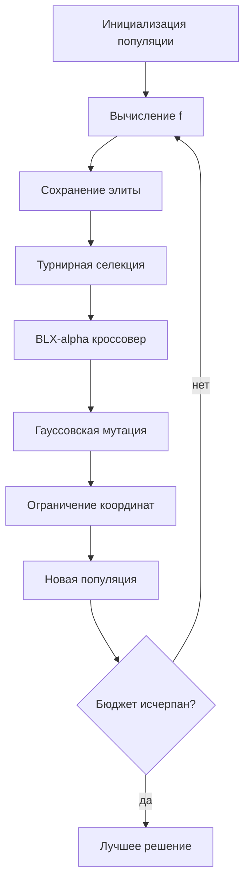

# Отчёт по лабораторной работе №1

## Вариант и постановка

Вариант 20, группа 517, номер в списке 18. Размерность `d=7`. Минимизируется

`f(x) = √|(Σxᵢ²)² − (Σxᵢ)²| + (0.5Σxᵢ² + Σxᵢ)/d + 0.5` при `−15 ≤ xᵢ ≤ 15`.

Известный глобальный минимум расположен в `xᵢ=-1`, `f(x*)=0`.

## Представление и алгоритм

Генотип и фенотип совпадают: вещественный вектор из семи координат. Использованы равномерная инициализация, турнирная селекция размера 3, BLX-α-кроссовер (`α=0.35`), гауссовская мутация, отсечение координат по границам и элитизм одной особи. Популяция — 60, вероятность кроссовера — 0.9, вероятность мутации каждой координаты — 0.2, бюджет — 12000 вычислений функции.

## Эксперимент

Выполнено 20 независимых запусков. Конфигурации отличаются только масштабом мутации: 2% и 8% ширины области. Случайный поиск получает тот же бюджет вычислений.

| Метод | Лучшее | Среднее | Медиана | Ст. отклонение | Худшее |
|---|---:|---:|---:|---:|---:|
| GA_sigma_2pct | 0.22509623 | 0.3355936 | 0.3369904 | 0.057862779 | 0.4362425 |
| GA_sigma_8pct | 0.13240318 | 0.28049075 | 0.28572725 | 0.063133499 | 0.37670448 |
| random_search | 21.809866 | 40.265241 | 41.579445 | 9.7678745 | 57.564799 |

Лучший результат ГА: `0.132403184121` при `x=[-1.4945482, -1.080993, -0.636388, -1.0130243, -0.8570875, -0.3840224, -0.5294923]`.

## Вывод

Функция HGBat невыпукла и связывает все координаты через две суммы. Больший масштаб мутации усиливает исследование пространства, меньший — локальное уточнение около найденного минимума. Сравнение статистик показывает устойчивость, а не единичный удачный запуск.

Файлы: [runs.csv](runs.csv), [summary.csv](summary.csv), [convergence.csv](convergence.csv), [convergence.svg](convergence.svg).
