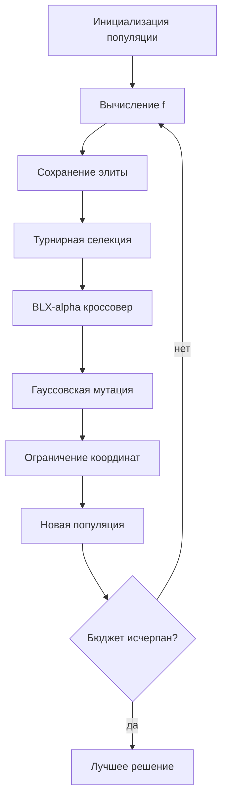

# Отчёт по лабораторной работе №1

## Вариант и постановка

Вариант 20, группа 517, номер в списке 18. Размерность `d=7`. Минимизируется

`f(x) = √|(Σxᵢ²)² − (Σxᵢ)²| + (0.5Σxᵢ² + Σxᵢ)/d + 0.5` при `−15 ≤ xᵢ ≤ 15`.

Известный глобальный минимум расположен в `xᵢ=-1`, `f(x*)=0`.

## Представление и алгоритм

Пространство решений — `D=[−15,15]⁷`. Генотип и фенотип совпадают: вещественный вектор из семи координат, декодирование не требуется. Равномерная инициализация сразу создаёт допустимые решения.

Турнирная селекция не требует масштабирования значений HGBat. BLX-α-кроссовер работает непосредственно с вещественными координатами и исследует промежуток между родителями и его окрестность. Гауссовская мутация обеспечивает локальное непрерывное изменение, отсечение гарантирует границы, элитизм сохраняет лучшее найденное решение.

| Параметр | Значение |
|---|---|
| Популяция | 60 |
| Селекция | турнир 3 |
| Кроссовер | BLX-α, `α=0.35`, вероятность 0.9 |
| Мутация | гауссовская, вероятность каждой координаты 0.2 |
| Масштаб мутации | 2% или 8% ширины области |
| Обработка границ | отсечение до `[−15,15]` |
| Элитизм | 1 особь |
| Критерий остановки | 12000 вычислений функции |

## Эксперимент

Выполнено 20 независимых запусков с различными фиксированными seed. Конфигурации отличаются только масштабом мутации: 2% и 8% ширины области. Случайный поиск получает тот же бюджет вычислений. Полная таблица параметров сохранена в [parameters.csv](parameters.csv). На графике сходимости для `GA_sigma_2pct` показаны минимум, среднее и максимум лучшего значения по всем 20 запускам на каждом поколении.

| Метод | Лучшее | Среднее | Медиана | Ст. отклонение | Худшее |
|---|---:|---:|---:|---:|---:|
| GA_sigma_2pct | 0.22509623 | 0.3355936 | 0.3369904 | 0.057862779 | 0.4362425 |
| GA_sigma_8pct | 0.13240318 | 0.28049075 | 0.28572725 | 0.063133499 | 0.37670448 |
| random_search | 21.809866 | 40.265241 | 41.579445 | 9.7678745 | 57.564799 |

Лучший результат ГА: `0.132403184121` при `x=[-1.4945482, -1.080993, -0.636388, -1.0130243, -0.8570875, -0.3840224, -0.5294923]`.

## Вывод

Функция HGBat невыпукла и несепарабельна: изменение одной координаты одновременно влияет на обе агрегированные суммы, поэтому независимый покоординатный локальный поиск и случайная выборка не используют структуру хороших решений.

Масштаб 8% дал среднее значение на `16.4%` лучше масштаба 2%. Его средний результат лучше случайного поиска примерно в `143.6` раза. Лучшее значение `0.132403` имеет абсолютный разрыв `0.132403` до известного оптимума 0: это хороший приближённый результат при заданном бюджете, но не доказательство достижения точного минимума. Вывод подтверждается серией запусков, а не единственной удачной траекторией.

Файлы: [parameters.csv](parameters.csv), [runs.csv](runs.csv), [summary.csv](summary.csv), [convergence.csv](convergence.csv), [convergence.svg](convergence.svg).
