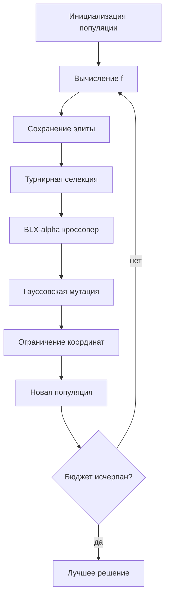

# Отчёт по лабораторной работе №1

## Вариант и постановка

Вариант 6, группа 517, номер в списке 16. Размерность `d=5`. Минимизируется

`f(x) = 418.9829·d − Σ xᵢ sin(√|xᵢ|)` при `−500 ≤ xᵢ ≤ 500`.

Известный глобальный минимум расположен около `xᵢ=420.968746`, `f(x*)≈0`.

## Представление и алгоритм

Генотип и фенотип совпадают: вещественный вектор из пяти координат. Использованы равномерная инициализация, турнирная селекция размера 3, BLX-α-кроссовер (`α=0.35`), гауссовская мутация, отсечение координат по границам и элитизм одной особи. Популяция — 60, вероятность кроссовера — 0.9, вероятность мутации каждой координаты — 0.2, бюджет — 12000 вычислений функции.

## Эксперимент

Выполнено 20 независимых запусков. Конфигурации отличаются только масштабом мутации: 5% и 15% ширины области. Случайный поиск получает тот же бюджет вычислений.

| Метод | Лучшее | Среднее | Медиана | Ст. отклонение | Худшее |
|---|---:|---:|---:|---:|---:|
| GA_sigma_5pct | 118.47596 | 222.18528 | 227.02414 | 116.86031 | 473.82063 |
| GA_sigma_15pct | 0.12958426 | 121.46677 | 119.1331 | 95.519504 | 355.84448 |
| random_search | 343.81826 | 468.98445 | 474.74438 | 87.023094 | 606.73247 |

Лучший результат ГА: `0.12958426256` при `x=[420.5162372, 421.284196, 421.5640199, 420.5620693, 421.4186154]`.

## Вывод

Функция Швефеля мультимодальна: локальные экстремумы затрудняют локальный и чисто случайный поиск. Больший масштаб мутации усиливает исследование пространства, меньший — локальное уточнение. Сравнение статистик показывает устойчивость, а не единичный удачный запуск.

Файлы: [runs.csv](runs.csv), [summary.csv](summary.csv), [convergence.csv](convergence.csv), [convergence.svg](convergence.svg).
