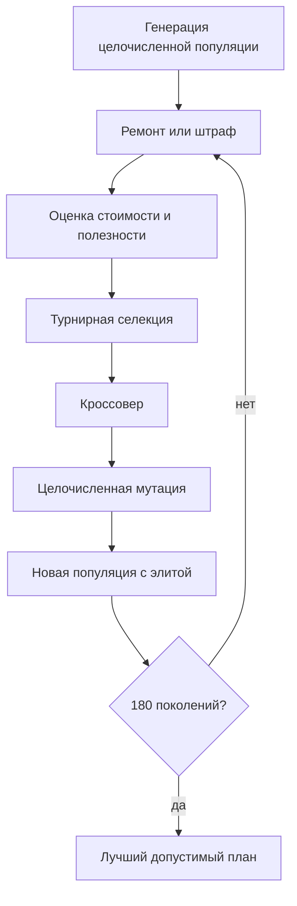

# Отчёт по лабораторной работе №2

## Вариант и постановка

Вариант 6, группа 517, номер в списке 16: месячный план закупки расходных материалов при лимите бюджета и минимальных запасах. Сгенерировано 30 материалов с фиксированным `seed=6160026`. Бюджет — 5057 условных единиц.

## Представление и ограничения

Особь — целочисленный вектор `x=(x₁,…,x₃₀)`, где `xᵢ` — закупаемое количество материала. Ограничения: `minimumᵢ ≤ xᵢ ≤ maximumᵢ` и `Σ costᵢ·xᵢ ≤ 5057`. Цель — максимизировать `Σ utilityᵢ·xᵢ`; в минимизируемом фитнесе используется отрицательная полезность и штраф за нарушения.

## Алгоритм

Популяция — 80, поколений — 180, турнирная селекция размера 3, вероятность кроссовера — 0.9, вероятность применения мутации — 0.25, элитизм — одна особь. Сравниваются:

1. ремонт + равномерный кроссовер;
2. штрафы + равномерный кроссовер — меняется только работа с ограничениями;
3. ремонт + одноточечный кроссовер — меняется только кроссовер.

## Обязательные проверки

В [feasibility_examples.csv](feasibility_examples.csv) приведены два допустимых и два недопустимых решения. Случайный допустимый поиск использует тот же бюджет — 14300 оценок. Жадная конструктивная эвристика приведена как дополнительная понятная базовая линия.

## Результаты 20 независимых запусков

Фитнес минимизируется; для допустимых решений он равен отрицательной полезности.

| Метод | Лучший фитнес | Средний | Медиана | Ст. отклонение | Худший | Лучшая полезность | Допустимые запуски |
|---|---:|---:|---:|---:|---:|---:|---:|
| repair_uniform | -12473 | -12469.15 | -12468 | 3.8699245 | -12456 | 12473 | 100% |
| penalty_uniform | -12368 | -12213.8 | -12197 | 79.641037 | -12010 | 12368 | 100% |
| repair_one_point | -12477 | -12467.45 | -12468 | 6.847781 | -12444 | 12477 | 100% |
| random_feasible_search | -11344 | -11047.45 | -11050 | 115.44626 | -10861 | 11344 | 100% |
| greedy_constructive | -12467 | -12467 | -12467 | 0 | -12467 | 12467 | 100% |

Лучший план: полезность `12477`, стоимость `5054` из бюджета `5057`. Подробности находятся в [best_plan.csv](best_plan.csv).

## Вывод

Целочисленное кодирование непосредственно соответствует количествам материалов. Ремонт быстро возвращает решение в допустимую область, а штрафной подход допускает исследование недопустимых промежуточных решений. Контролируемая замена кроссовера показывает влияние оператора без одновременной смены метода ограничений. Серия запусков позволяет судить об устойчивости результатов.

Файлы: [runs.csv](runs.csv), [summary.csv](summary.csv), [convergence.svg](convergence.svg), [best_plan.csv](best_plan.csv).
