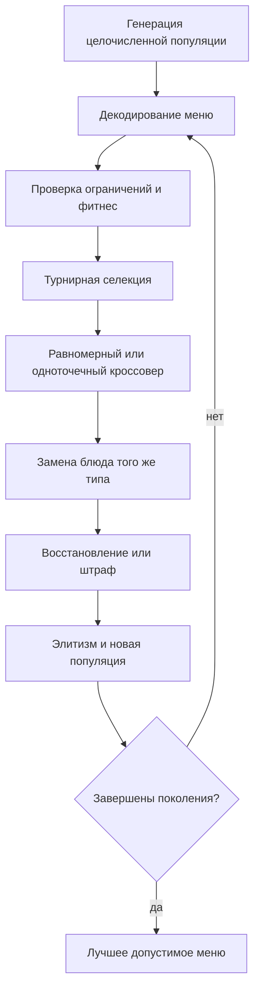

# Отчёт по лабораторной работе №2

## Вариант и постановка

Вариант 20, группа 517, номер в списке 18: меню на неделю с ограничениями калорийности, стоимости и разнообразия. Используются 36 синтетических блюд: по 12 вариантов завтрака, обеда и ужина. Данные генерируются с фиксированным `seed=20180517`; диапазоны калорийности и стоимости заданы отдельно для каждого типа приёма пищи, оценка блюда генерируется в диапазоне 55–100. Полные данные находятся в [dishes.csv](../data/dishes.csv), параметры экземпляра — в [config.json](../data/config.json).

Особь — целочисленный вектор из 21 индекса блюда: завтрак, обед и ужин для каждого дня. Декодер сопоставляет позицию вектора дню и типу приёма пищи, а индекс — строке таблицы блюд. Суточная калорийность — 1700–2200 ккал, недельная стоимость — не более 3800, различных блюд — не менее 15, повтор блюда — не более 2 раз. Максимизируется суммарная оценка блюд; для минимизации используется её отрицание и штраф за нарушения.

## Алгоритм

Популяция — 80, поколений — 180, турнирная селекция размера 3, вероятность кроссовера — 0.9, вероятность применения мутации — 0.25, вероятность замены отдельного блюда при мутации — 0.08, элитизм — одна особь. Коэффициенты штрафа: 1000 за единицу отклонения калорийности или превышения бюджета и 3000 за недостающее уникальное блюдо или лишний повтор. При диапазоне оценок 55–100 даже минимальное нарушение дороже любого возможного выигрыша целевой функции. Полная таблица находится в [parameters.csv](parameters.csv).

Операторы учитывают структуру меню: мутация выбирает блюдо только допустимого типа для конкретного слота; кроссоверы работают между одинаковыми позициями дней и приёмов пищи. Сравниваются восстановление допустимости и штрафы при одинаковом равномерном кроссовере, затем равномерный и одноточечный кроссоверы при одинаковом восстановлении. Восстановление изменяет недопустимого потомка до выполнения всех ограничений и не использует целевую оценку. Случайный допустимый поиск получает тот же бюджет — 14300 обращений к фитнес-функции.

Два допустимых и два недопустимых решения с расшифровкой каждого нарушения приведены в [feasibility_examples.csv](feasibility_examples.csv).

## Результаты 20 независимых запусков

| Метод | Лучший фитнес | Средний | Медиана | Ст. отклонение | Худший | Лучшая полезность | Допустимые запуски |
|---|---:|---:|---:|---:|---:|---:|---:|
| repair_uniform | -1936 | -1935.9 | -1936 | 0.30779351 | -1935 | 1936 | 100% |
| penalty_uniform | -1936 | -1935.95 | -1936 | 0.2236068 | -1935 | 1936 | 100% |
| repair_one_point | -1936 | -1935.9 | -1936 | 0.30779351 | -1935 | 1936 | 100% |
| random_feasible_search | -1872 | -1830.95 | -1825 | 16.715814 | -1808 | 1872 | 100% |

Лучшее меню: полезность `1936`, стоимость `3266` из `3800`, различных блюд — `15`. Подробности находятся в [best_menu.csv](best_menu.csv).

## Вывод

Целочисленное кодирование напрямую задаёт блюда по приёмам пищи и исключает неверный тип блюда на уровне операторов. Восстановление с равномерным кроссовером дало средний фитнес `-1935.90`, штрафы — `-1935.95`, восстановление с одноточечным кроссовером — `-1935.90`. Различия между вариантами ГА малы, однако все финальные решения допустимы; это показывает устойчивость, а не единичный успех.

Средний фитнес случайного допустимого поиска равен `-1830.95`, то есть ГА стабильно находит более высокую суммарную оценку при том же бюджете. Лучшее меню имеет оценку `1936`, выполняет все четыре группы ограничений и понятно представлено по дням в [best_menu.csv](best_menu.csv). Поэтому результат следует считать хорошим для созданного экземпляра; утверждение о глобальном оптимуме не делается, поскольку полный перебор `12²¹` допустимых по типу комбинаций практически невозможен.

Файлы: [parameters.csv](parameters.csv), [runs.csv](runs.csv), [summary.csv](summary.csv), [convergence.svg](convergence.svg), [best_menu.csv](best_menu.csv), [feasibility_examples.csv](feasibility_examples.csv).
